# 🔐 Enterprise Active Directory Integration & Cross-Platform Authentication (RHEL 10)

## 📌 The Big Why
In modern enterprise environments, managing standalone server credentials is an operational nightmare and a severe security risk. This project demonstrates how to bridge the gap between Windows and Linux ecosystems by integrating a Red Hat Enterprise Linux 10 (RHEL 10) server into a Windows Server Active Directory (AD) domain. By leveraging Kerberos and SSSD, this architecture establishes centralized identity management, unified access control, and seamless cross-platform authentication, eliminating the need for local account sprawl.

## 🏗️ Logical Architecture Flow
Below is the logical flow of the Cross-Platform Identity pipeline. The Windows Server acts as the primary Domain Controller (DC) and DNS server for the `lab.local` domain. The RHEL 10 node is configured to route all authentication requests through the DC using the `realmd` system, which automatically configures the System Security Services Daemon (SSSD) to handle LDAP lookups and Kerberos ticketing. 

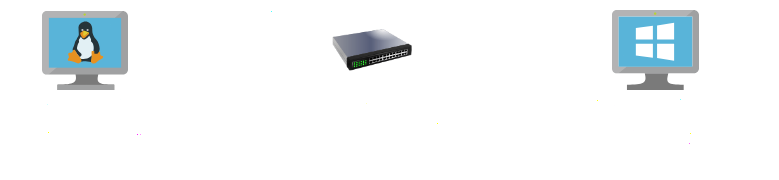

*(Note: Diagram illustrates the DNS resolution path and Kerberos authentication ticket exchange between the RHEL node and the Windows Domain Controller).*

## 🛠️ Core Commands Used
*   `sudo nmtui` - To configure the Linux network interface to point explicitly to the Windows Server for DNS resolution, ensuring SRV records can be located.
*   `sudo hostnamectl set-hostname <fqdn>` - To enforce a Fully Qualified Domain Name (FQDN) required for successful Kerberos authentication.
*   `realm discover lab.local` - To probe the network, locate the Active Directory domain, and verify that the required integration packages (SSSD, Kerberos) are supported.
*   `sudo realm join -U Administrator lab.local` - To securely bind the RHEL system to the Windows AD Domain and create a computer object within the directory.
*   `su - zack@lab.local` - To verify cross-platform authentication and trigger the `oddjob-mkhomedir` module to automatically provision a local home directory for the domain user.

## 📸 Verification & Proof of Concept

### 1. Windows Server Domain Controller Provisioning
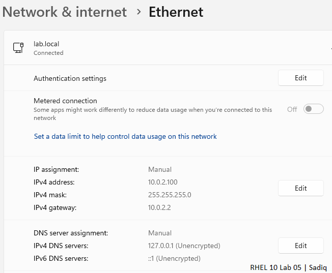
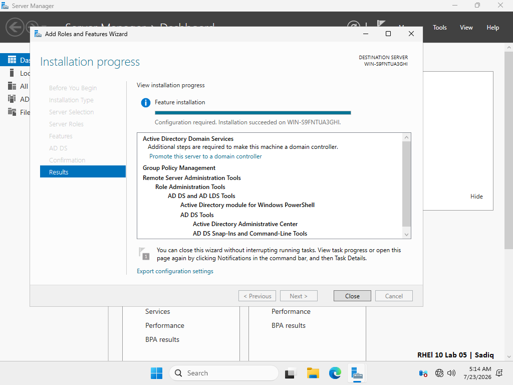

### 2. Active Directory User Creation
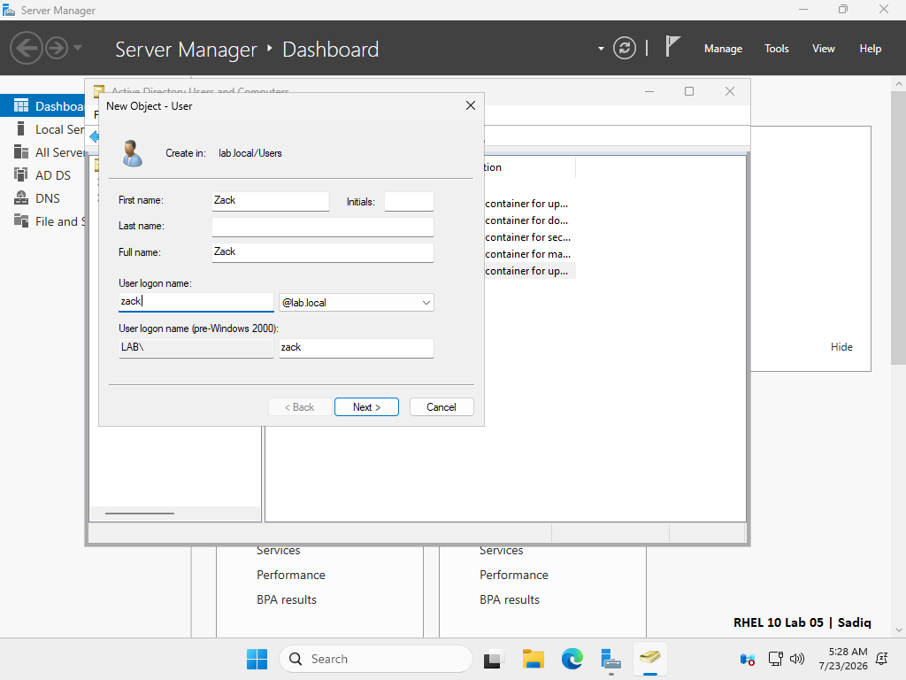
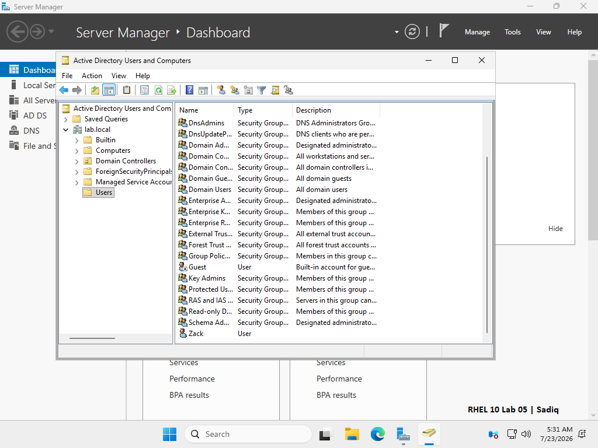

### 3. RHEL 10 Network & DNS Configuration
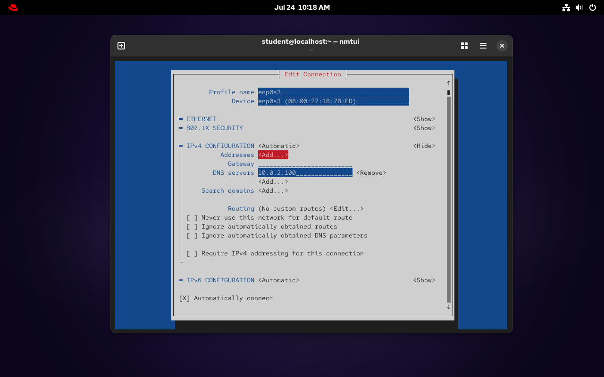
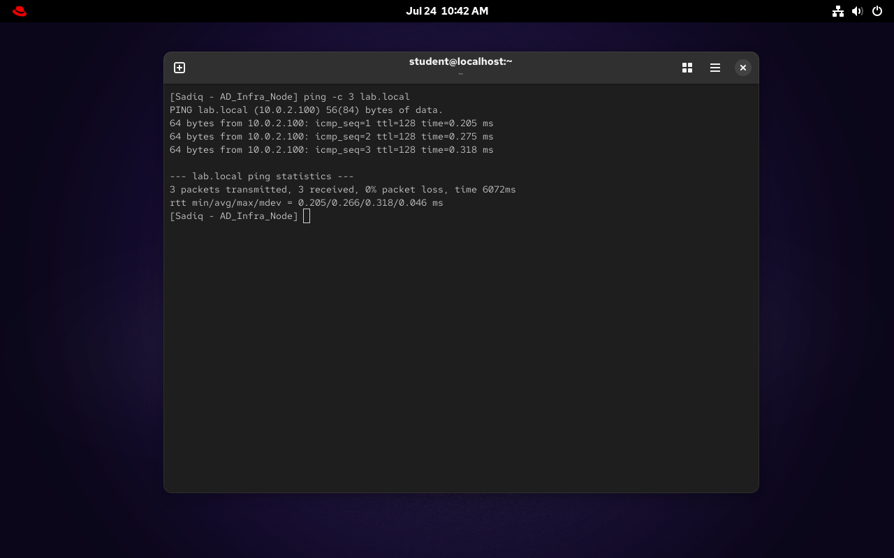

### 4. Domain Discovery & Secure Binding
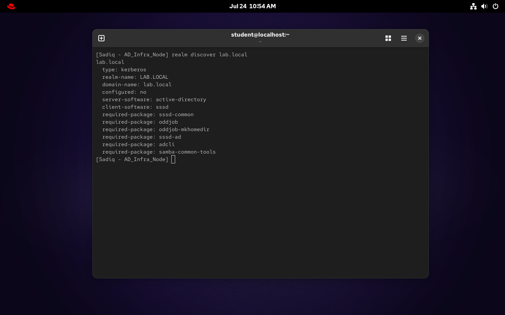
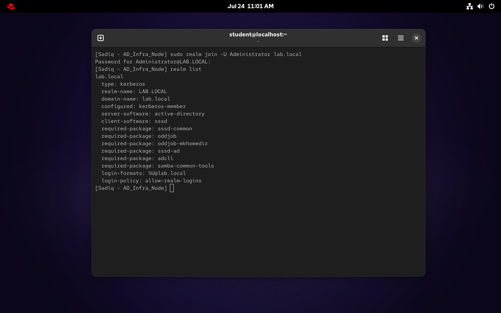

### 5. Cross-Platform Authentication & Verification
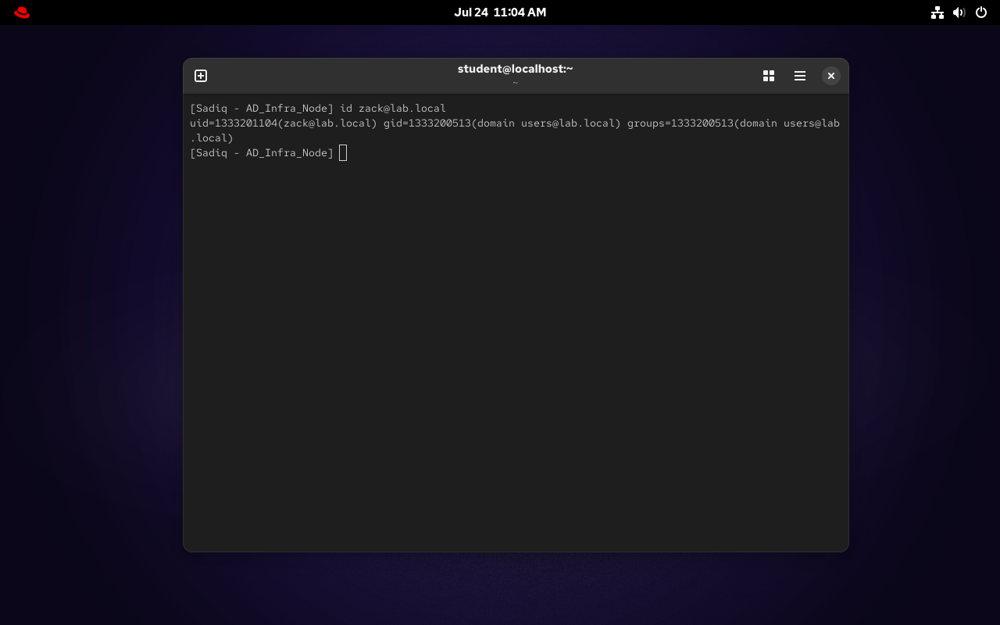
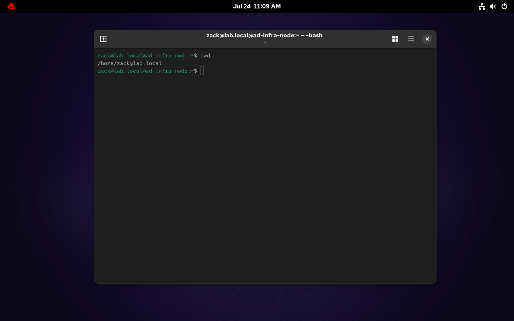

## ⚠️ Troubleshooting Risk & Lessons Learned

**1. DNS Resolution Timeout (NXDOMAIN / Time Out):** 
During the initial network testing phase, the RHEL node failed to resolve `lab.local` despite having the correct DNS IP. 
*   **Resolution:** Discovered that the Windows Server Firewall was actively blocking incoming port 53 (DNS) and ICMP (Ping) traffic. Temporarily disabling the restrictive firewall profiles (`Set-NetFirewallProfile -Profile Domain,Public,Private -Enabled False`) or adding specific allow-rules resolved the communication barrier.

**2. Domain Join Rejection (Hostname Not Set Correctly):** 
The `realm join` execution was initially rejected by the Active Directory with the error *"This computer's host name is not set correctly."* Active Directory requires strict compliance with Kerberos protocols.
*   **Resolution:** Modified the RHEL machine's default `localhost` identity to a proper FQDN (`ad-infra-node.lab.local`) using `hostnamectl`, which successfully aligned with the AD domain structure and allowed the Kerberos ticket to be generated.
